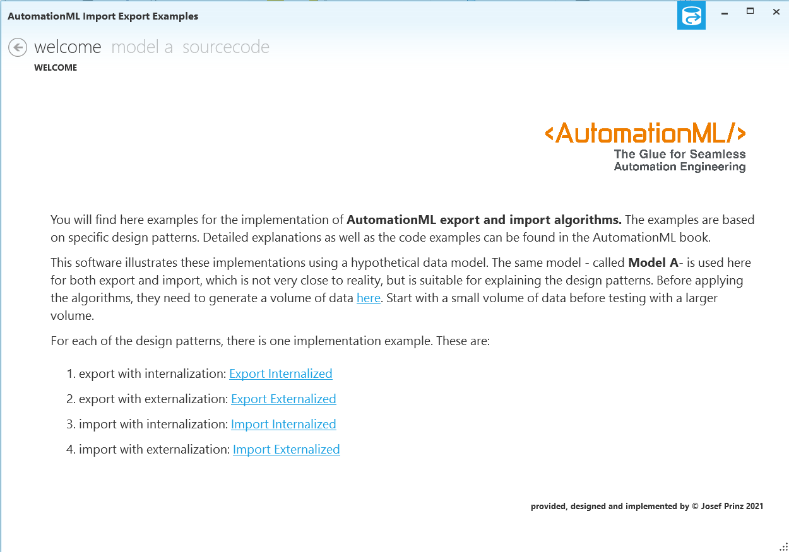

---

![][1]

---

# AMLImportExport
Example implementations of import export algorithms for AutomationML data.

You will find here examples for the implementation of **AutomationML export and import algorithms.** The examples are based on specific design patterns. Detailed explanations as well as the code examples can be found in the [AutomationML cook book](https://www.degruyter.com/document/doi/10.1515/9783110745979/html).

The published source code illustrates these implementations as a guided walkthrough. 

[1]: https://raw.githubusercontent.com/AutomationML/AMLEngine2.1/master/img/AutomationML-Logo.png
